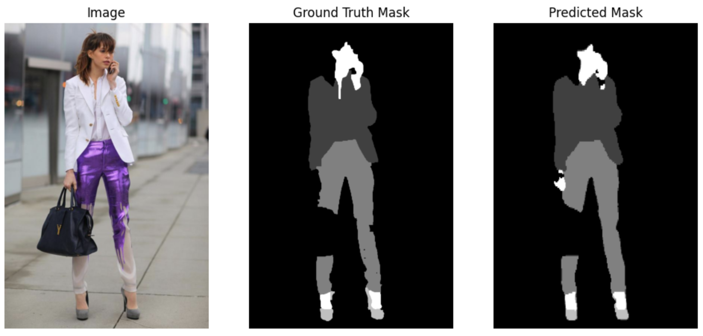
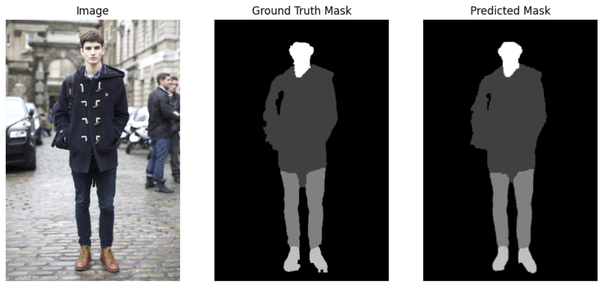

# People Cloth Segmentation using SegFormer and MANet


This repository contains the training and evaluation code for the *People Clothing Segmentation* dataset on Kaggle using the *SegFormer* and *MANet* architectures. 

## Dataset
The [dataset](https://www.kaggle.com/datasets/rajkumarl/people-clothing-segmentation/data) consists of 1000 images of people with clothing. Each image has a corresponding mask that segments the person and clothes from the background. 

To simplify the training complexity, the original segmentation masks are divided into 5 classes: 
`0: Background, 1: Top Clothes, 2: Bottom Clothes, 3: Shoes, 4: People Skin`

## Performance
The model is trained using the [Focal Loss](https://arxiv.org/abs/1708.02002) and the [Adam Optimizer](https://arxiv.org/abs/1711.05101), with weight decay added to prevent overfitting. The encoder weights are frozen during training.

The model is trained for 200 epochs (with 3x data augmentation) and achieves a mIoU of **94.66** on test data. You can reproduce the experiment result by downloading the pre-trained best model in this repository, or maunally train the model using the provided code without changing the seed.

Here are two example mask predictions



## Architecture
The model uses the an ImageNet pre-trained SegFormer backbone ([mit_b1](https://huggingface.co/nvidia/mit-b1)) as the encoder. And an [MANet](https://arxiv.org/abs/2009.02130) is used as the decoder. Dropout layer is used to prevent overfitting.

See the architecture diagram below:


## Training
First run the following command to install the required packages:
```bash
pip install -r requirements.txt
```
Then run the following command to train the model:
```bash
mkdir data/aug_imgs
mkdir data/aug_masks
python data_augmentation.py
python train.py
```
You may need to download the dataset manually from the [Kaggle website](https://www.kaggle.com/datasets/rajkumarl/people-clothing-segmentation/data) and place the images and masks in the `data` folder.

